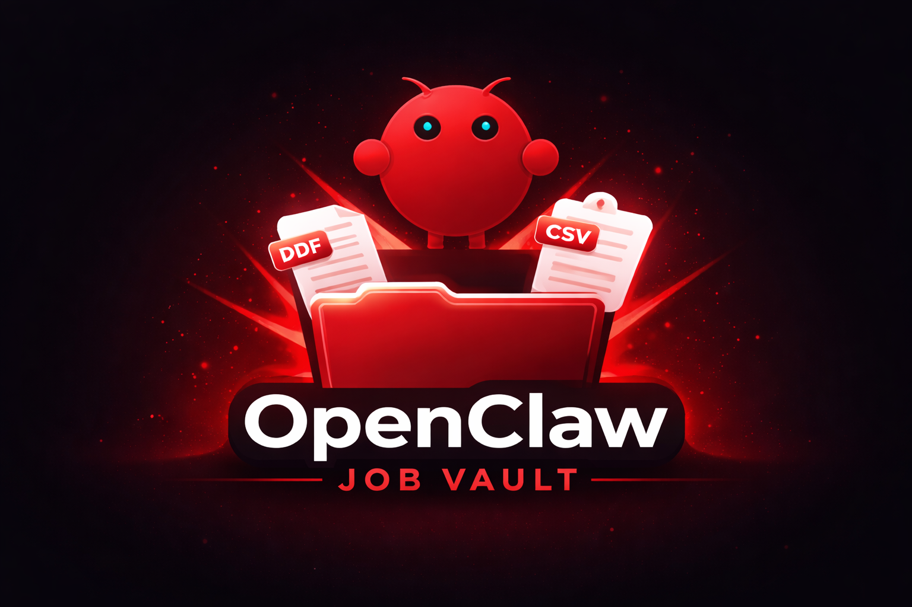

<p align="center">
  
</p>

# OpenClaw Job Vault

A hotkey-triggered AI agent that saves job postings as PDFs and automatically logs key details into a tracker.


**The problems:** 

1. Job portals store your application but not the job posting itself. Once a listing is closed or removed, the description is gone and you have no way to review it when you get an interview. 

2. Students also manually track every role they applied to in spreadsheets, which nobody keeps up with.

**The solution:** 

While viewing a job posting, press one hotkey.

The agent automatically:
- Saves a permanent PDF copy
- Extracts job details
- Logs the role into a tracker

You just apply to jobs. Everything is recorded in the background.

---

## Usage

You browse jobs in Chrome. When you're on a job posting:

1. Press **Ctrl + Alt + J**.
2. Continue applying

By the time you're done, the system has:

- Captured the full page (snapshot + PDF) and save it to your computer
- The agent extract title, company, requirements, salary, and location
- Saved a timestamped folder
- Added the application to `jobs.csv`

No copy-paste. No manual tracking. No lost job descriptions.

---

## Example Output


## How it works

1. Press **Ctrl + Alt + J** while on a job posting.
2. The launcher script captures the page (snapshot + PDF) via OpenClaw CLI.
3. The OpenClaw agent uses its `read` tool to read the snapshot, reasons about the content, and uses its `write` tool to create `meta.json` with extracted fields.
4. The script reads the agent's output and appends a row to `jobs.csv`.

The agent's behavior is defined in `agent/prompt.md`. Edit that file to change what the agent extracts or how it reasons -- no code changes needed.

---

## Project structure

```
openclaw_job_vault/
  agent/
    prompt.md                # agent instructions (the "brain")
  scripts/
    save-jd.ps1              # launcher - captures page, sends to agent
    OpenClawJobVault.ahk     # global hotkey (Ctrl+Alt+J)
  .env.example               # template for API key
  .gitignore
  README.md
```

### Output (saved to Desktop by default)

```
~/Desktop/OpenClaw Job Vault/
  jobs.csv                                       # running log of all saved jobs
  2026-02-17_14-30-00 - Software-Engineer-Intern/
    snapshot.txt       # page text
    job.pdf            # page as PDF
    page_url.txt       # original URL
    meta.json          # agent-extracted structured data
```

---

## Setup

### 1. Install dependencies

```bash
# OpenClaw CLI
npm install -g openclaw@latest

# AutoHotkey v2 (for the global hotkey)
winget install AutoHotkey.AutoHotkey
```

### 2. Configure OpenClaw

Create or edit `~/.openclaw/openclaw.json`:

```json
{
  "gateway": {
    "mode": "local"
  },
  "browser": {
    "enabled": true,
    "defaultProfile": "openclaw",
    "headless": false
  }
}
```

### 3. Add your LLM API key

Windows (PowerShell):
```bash
copy .env.example .env
```

macOS / Linux:
```bash
cp .env.example .env
```

Edit `.env` and paste your key:

```
OPENAI_API_KEY=sk-your-actual-key
```


### 4. Set up the hotkey

Double-click `scripts/OpenClawJobVault.ahk`. It auto-adds itself to Windows Startup so the hotkey is always available after login.

### 5. (Optional) Change the storage folder

By default, captures are saved to `~/Desktop/OpenClaw Job Vault/`. To change this, edit the `$StorageRoot` variable near the top of `scripts/save-jd.ps1`.

---

## Architecture

```
Hotkey
  ↓
PowerShell launcher
  ↓
OpenClaw browser capture (PDF + snapshot)
  ↓
OpenClaw agent (LLM)
  ↓
Structured extraction (meta.json)
  ↓
Append to jobs.csv

```

---

## License

MIT. Do whatever you want with it.

## Acknowledgments

- [OpenClaw](https://github.com/openclaw-ai/openclaw) for the OpenClaw CLI and agent.
- [AutoHotkey](https://www.autohotkey.com/) for the AutoHotkey script.
- [GPT-4o](https://openai.com/gpt-4o/) for the OpenAI API.
